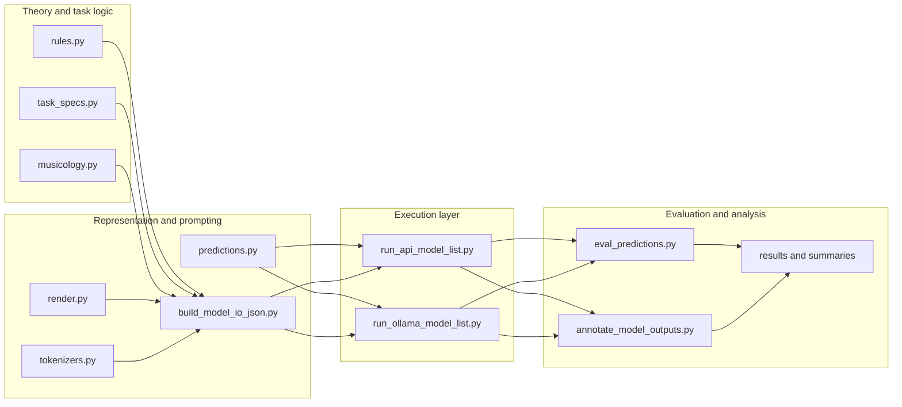

# Benchmark Components

This component view emphasizes logical modules rather than a strict runtime order.

```mermaid
flowchart LR
    subgraph Theory["Theory and task logic"]
        A["rules.py"]
        B["task_specs.py"]
        C["musicology.py"]
    end

    subgraph Representation["Representation and prompting"]
        D["render.py"]
        E["tokenizers.py"]
        F["predictions.py"]
        G["build_model_io_json.py"]
    end

    subgraph Execution["Execution layer"]
        H["run_api_model_list.py"]
        I["run_ollama_model_list.py"]
    end

    subgraph Analysis["Evaluation and analysis"]
        J["eval_predictions.py"]
        K["annotate_model_outputs.py"]
        L["results and summaries"]
    end

    A --> G
    B --> G
    C --> G
    D --> G
    E --> G
    F --> H
    F --> I
    G --> H
    G --> I
    H --> J
    H --> K
    I --> J
    I --> K
    J --> L
    K --> L
```
