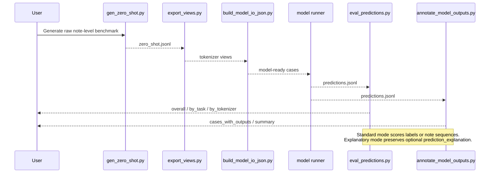

# Benchmark Sequence Diagram

This diagram shows the end-to-end benchmark runtime from raw case generation to evaluation and qualitative review.

```mermaid
sequenceDiagram
    participant U as User
    participant G as gen_zero_shot.py
    participant V as export_views.py
    participant C as build_model_io_json.py
    participant R as model runner
    participant E as eval_predictions.py
    participant A as annotate_model_outputs.py

    U->>G: Generate raw note-level benchmark
    G-->>V: zero_shot.jsonl
    V-->>C: tokenizer views
    C-->>R: model-ready cases
    R-->>E: predictions.jsonl
    R-->>A: predictions.jsonl
    E-->>U: overall / by_task / by_tokenizer
    A-->>U: cases_with_outputs / summary
    Note over E,A: Standard mode scores labels or note sequences.<br/>Explanatory mode preserves optional prediction_explanation.
```
