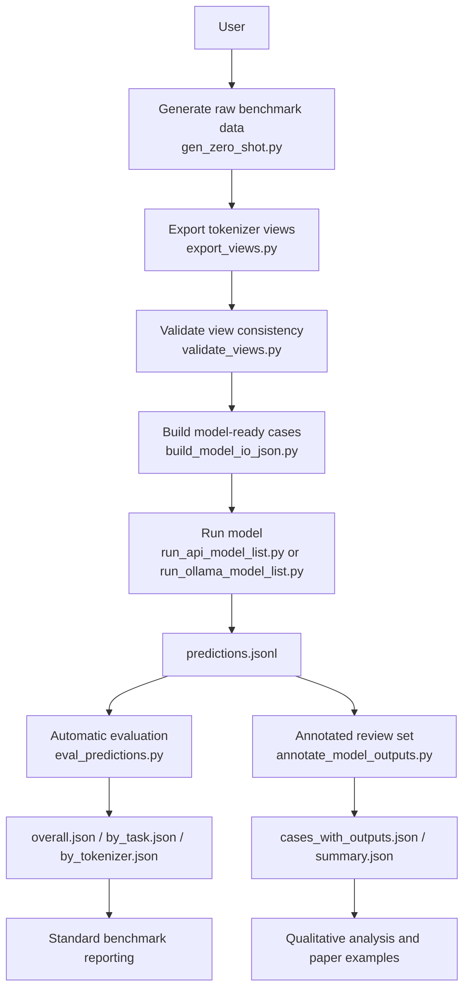

# Benchmark Usage Flow

```mermaid
flowchart TD
    A["User"] --> B["Generate raw benchmark data<br/>gen_zero_shot.py"]
    B --> C["Export tokenizer views<br/>export_views.py"]
    C --> D["Validate view consistency<br/>validate_views.py"]
    D --> E["Build model-ready cases<br/>build_model_io_json.py"]
    E --> F["Run model<br/>run_api_model_list.py or run_ollama_model_list.py"]
    F --> G["predictions.jsonl"]
    G --> H["Automatic evaluation<br/>eval_predictions.py"]
    G --> I["Annotated review set<br/>annotate_model_outputs.py"]
    H --> J["overall.json / by_task.json / by_tokenizer.json"]
    I --> K["cases_with_outputs.json / summary.json"]
    J --> L["Standard benchmark reporting"]
    K --> M["Qualitative analysis and paper examples"]
```
